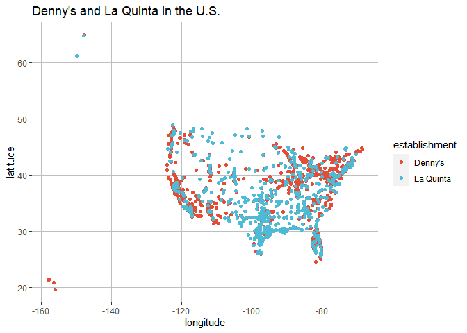
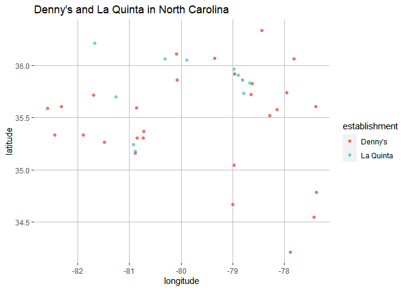
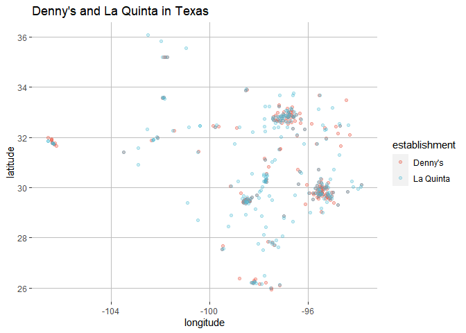

Lab 04 - La Quinta is Spanish for next to Denny’s, Pt. 1
================
Colin Li
01/31/2023

### Load packages and data

install.packages(“devtools”)
devtools::install_github(“rstudio-education/dsbox”)

``` r
library(tidyverse) 
library(dsbox) 
```

``` r
load("C:/Users/Colin/Documents/GitHub/Colin_lab4/data/laquinta.rda")
load("C:/Users/Colin/Documents/GitHub/Colin_lab4/data/dennys.rda")

states <- read_csv("data/states.csv")
```

### Exercise 1

``` r
nrow(dennys)
```

    ## [1] 1643

``` r
ncol(dennys)
```

    ## [1] 6

``` r
glimpse(dennys)
```

    ## Rows: 1,643
    ## Columns: 6
    ## $ address   <chr> "2900 Denali", "3850 Debarr Road", "1929 Airport Way", "230 …
    ## $ city      <chr> "Anchorage", "Anchorage", "Fairbanks", "Auburn", "Birmingham…
    ## $ state     <chr> "AK", "AK", "AK", "AL", "AL", "AL", "AL", "AL", "AL", "AL", …
    ## $ zip       <chr> "99503", "99508", "99701", "36849", "35207", "35294", "35056…
    ## $ longitude <dbl> -149.8767, -149.8090, -147.7600, -85.4681, -86.8317, -86.803…
    ## $ latitude  <dbl> 61.1953, 61.2097, 64.8366, 32.6033, 33.5615, 33.5007, 34.206…

1643 rows mean there are 1643 subjects in the dataset 6 columns mean
there are 6 variables the variables are address, city, state, zip code,
longitude, and latitude

### Exercise 2

``` r
glimpse(laquinta)
```

    ## Rows: 909
    ## Columns: 6
    ## $ address   <chr> "793 W. Bel Air Avenue", "3018 CatClaw Dr", "3501 West Lake …
    ## $ city      <chr> "\nAberdeen", "\nAbilene", "\nAbilene", "\nAcworth", "\nAda"…
    ## $ state     <chr> "MD", "TX", "TX", "GA", "OK", "TX", "AG", "TX", "NM", "NM", …
    ## $ zip       <chr> "21001", "79606", "79601", "30102", "74820", "75254", "20345…
    ## $ longitude <dbl> -76.18846, -99.77877, -99.72269, -84.65609, -96.63652, -96.8…
    ## $ latitude  <dbl> 39.52322, 32.41349, 32.49136, 34.08204, 34.78180, 32.95164, …

909 rows mean there are 909 subjects in the dataset 6 columns mean there
are 6 variables the variables are address, city, state, zip code,
longitude, and latitude

### Exercise 3

Yes, there are La Quinta’s locations outside of the U.S.: Canada,
Mexico, China, New Zealand, Turkey, UAE, Chile, Colombia The Denny’s
website does not allow me to check locations outside of the U.S., but
professor Google told me there are Dennys in Chile, Canada, Mexico,
Costa Rica, Honduras, El Salvador, the United Kingdom and New Zealand.

…

### Exercise 4

We can find U.S. territory’s longitude and filter data outside of the
range and do the same for latitude.

…

### Exercise 5

``` r
dennys %>%
  filter(!(state %in% states$abbreviation))
```

    ## # A tibble: 0 × 6
    ## # … with 6 variables: address <chr>, city <chr>, state <chr>, zip <chr>,
    ## #   longitude <dbl>, latitude <dbl>

No dennys locations outside of US

…

### Exercise 6

``` r
dennys <- dennys %>%
  mutate(country = "United States")
```

…

### Exercise 7

``` r
laquinta %>%
  filter(!(state %in% states$abbreviation))
```

    ## # A tibble: 14 × 6
    ##    address                                     city  state zip   longi…¹ latit…²
    ##    <chr>                                       <chr> <chr> <chr>   <dbl>   <dbl>
    ##  1 Carretera Panamericana Sur KM 12            "\nA… AG    20345  -102.    21.8 
    ##  2 Av. Tulum Mza. 14 S.M. 4 Lote 2             "\nC… QR    77500   -86.8   21.2 
    ##  3 Ejercito Nacional 8211                      "Col… CH    32528  -106.    31.7 
    ##  4 Blvd. Aeropuerto 4001                       "Par… NL    66600  -100.    25.8 
    ##  5 Carrera 38 # 26-13 Avenida las Palmas con … "\nM… ANT   0500…   -75.6    6.22
    ##  6 AV. PINO SUAREZ No. 1001                    "Col… NL    64000  -100.    25.7 
    ##  7 Av. Fidel Velazquez #3000 Col. Central      "\nM… NL    64190  -100.    25.7 
    ##  8 63 King Street East                         "\nO… ON    L1H1…   -78.9   43.9 
    ##  9 Calle Las Torres-1 Colonia Reforma          "\nP… VE    93210   -97.4   20.6 
    ## 10 Blvd. Audi N. 3 Ciudad Modelo               "\nS… PU    75010   -97.8   19.2 
    ## 11 Ave. Zeta del Cochero No 407                "Col… PU    72810   -98.2   19.0 
    ## 12 Av. Benito Juarez 1230 B (Carretera 57) Co… "\nS… SL    78399  -101.    22.1 
    ## 13 Blvd. Fuerza Armadas                        "con… FM    11101   -87.2   14.1 
    ## 14 8640 Alexandra Rd                           "\nR… BC    V6X1…  -123.    49.2 
    ## # … with abbreviated variable names ¹​longitude, ²​latitude

Canada (“ON”, “BC”), Mexico (“AG”, “QR”, “CH”, “NL”, “VE”, “PU”, “SL”),
Colombia (“ANT”), FM(“Honduras”)

### Exercise 8

``` r
laquinta <- laquinta %>%
  mutate(country = case_when(
    state %in% state.abb     ~ "United States",
    state %in% c("ON", "BC") ~ "Canada",
    state == "ANT"           ~ "Colombia",
    state %in% c("AG", "QR", "CH", "NL", "VE", "PU", "SL") ~ "Mexico",                        state == "FM"           ~ "Honduras"

  ))

laquinta <- laquinta %>%
  filter(country == "United States")
```

### Exercise 9

``` r
library(dplyr)

dennys %>%
  dplyr::count(state) %>%
  inner_join(states, by = c("state" = "abbreviation"))
```

    ## # A tibble: 51 × 4
    ##    state     n name                     area
    ##    <chr> <int> <chr>                   <dbl>
    ##  1 AK        3 Alaska               665384. 
    ##  2 AL        7 Alabama               52420. 
    ##  3 AR        9 Arkansas              53179. 
    ##  4 AZ       83 Arizona              113990. 
    ##  5 CA      403 California           163695. 
    ##  6 CO       29 Colorado             104094. 
    ##  7 CT       12 Connecticut            5543. 
    ##  8 DC        2 District of Columbia     68.3
    ##  9 DE        1 Delaware               2489. 
    ## 10 FL      140 Florida               65758. 
    ## # … with 41 more rows

### Exercise 10

``` r
library(ggsci)

dennys <- dennys %>%
  mutate(establishment = "Denny's")

laquinta <- laquinta %>%
  mutate(establishment = "La Quinta")

dn_lq <- bind_rows(dennys, laquinta)

ggplot(dn_lq, mapping = aes(x = longitude,
                            y = latitude,
                            color = establishment)) +
  geom_point() + ggtitle("Denny's and La Quinta in the U.S.") + scale_color_npg() +theme(
  panel.background = element_rect(fill = NA),
  panel.grid.major = element_line(colour = "grey"))
```

<!-- -->

### Exercise 11

``` r
dn_lq_nc <- dn_lq %>%
  filter(state == "NC")

ggplot(dn_lq_nc, mapping = aes(x = longitude,
                            y = latitude,
                            color = establishment)) +
  geom_point(alpha = 0.7) + ggtitle("Denny's and La Quinta in North Carolina") + scale_color_npg() +theme(
  panel.background = element_rect(fill = NA),
  panel.grid.major = element_line(colour = "grey"))
```

<!-- -->

The joke sort of holds. The reason I say sort of is because there are
many Dennys in the southeast do not have La Quinta hotels around.

### Exercise 12

``` r
dn_lq_tx <- dn_lq %>%
  filter(state == "TX")

ggplot(dn_lq_tx, mapping = aes(x = longitude,
                            y = latitude,
                            color = establishment)) +
  geom_point(alpha = 0.3) + ggtitle("Denny's and La Quinta in Texas") + scale_color_npg() +theme(
  panel.background = element_rect(fill = NA),
  panel.grid.major = element_line(colour = "grey"))
```

<!-- --> The joke holds better
in Texas than in North Carolina. There is a lot overlap. When there’s
not, pretty much every Denny’s has a La Quinta nearby.
